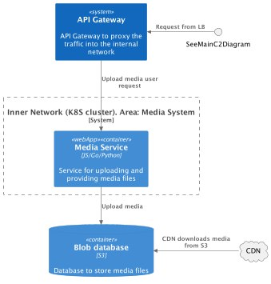

# System Design course

Welcome to my personal repository for the [System Design course](https://balun.courses/courses/system_design).

This project is dedicated to crafting a robust system design for a social network platform, emphasizing: high-load, fault-tolerance, performance, and scalability.

## Open API Documentation
* [Swagger Hub](https://app.swaggerhub.com/apis/NISSAN65/Social_Network_API/1.0.0)
* [YAML file](api/rest_api.yml)

## Functional requirements:

### User Profiles

- **View Profile:**
  - Users can explore profiles by clicking on profile pictures or usernames.
  - Discover basic information like names, profile pictures, and friends.

### Friends

- **Friend List:**
  - Users can navigate their list of friends.
  - Scroll through profiles, view snapshots, and explore connections.

- **Remove Friend:**
  - Users can unfriend their friends.

### Friend Requests

- **View Friend Requests:**
  - Check incoming and outgoing friend requests.
  - Approve or decline the requests.

- **Send Friend Request:**
  - Users can initiate new connections by sending friend requests.

- **Cancel Friend Request:**
  - Ability to cancel friend requests you've sent.

### Feeds

- **View Feeds:**
  - Scroll through a dynamic feed of posts from friends.
  - Mix of text, images, and shared media.

- **Create Post:**
  - Users are able to create posts with text and media.
  - Posts appear in friends' feeds.
  - Max size of a post 4096 symbols

- **Delete Post:**
  - Users can manage their content by deleting posts when needed.

### Media

- **Upload Media:**
  - Enhance posts by uploading images and media files.

- **Delete Media:**
  - Users can control media content by deleting uploaded files.

## Chats

- **View Chats:**
  - Explore chat history.
  - Each chat includes a title (if provided) and the last message sent.

- **Send Messages:**
  - Communicate with others through text and media messages.

## Non-functional requirements:
### Overall System:

- **Daily Active Users (DAU):**
  - The system is designed to handle up to 50,000,000 Daily Active Users.

- **Availability:**
  - The system should maintain an availability of 99.95% to ensure continuous service.

- **Service Operation Time:**
  - The system is designed to operate seamlessly for a minimum of 5 years.

- **Geo Distribution:**
  - The system supports users in the Commonwealth of Independent States (CIS) region.

- **Seasonality:**
  - The system is designed to handle usage patterns without significant seasonality.

## User Profiles Module:

- **Response Time to View Profile:**
  - The system aims for a response time of 2 seconds when user opens the profile page.

## Friends Module:

- **Response Time to Navigate Friend List:**
  - The system aims for a response time of 1 second when users navigate their friend list.

- **Unfriend Action:**
  - Unfriending a user should be completed within 2 seconds.

## Friend Requests Module:

- **Response Time for Approving/Declining Requests:**
  - Approving or declining friend requests should have a response time of 2 seconds.

- **Send Friend Request:**
  - Sending a friend request should take no longer than 1 second.

## Feeds Module:

- **Response Time to Scroll Feeds:**
  - The system aims for a response time of 2 seconds when users scroll through their feeds.

- **Post Creation:**
  - Creating and posting content should be completed within 4 seconds.

## Media Module:

- **Response Time to Upload Media:**
  - Uploading media files should have a response time of 3 seconds.

- **Media Size Limit:**
  - Media files are limited to a maximum size of 5 MB to ensure efficient storage and quick download times.

- **Supported Media Types:**
  - The system supports various media types, including images (JPEG, PNG, GIF).

- **Media Deletion:**
  - Users can delete media files with a response time of 2 seconds.

## Chats Module:

- **Response Time to Explore Chat History:**
  - Exploring chat history should have a response time of 2 seconds.

- **Sending Messages:**
  - Sending text messages should be completed within 1 second.
  - Max size of a message is 1000 symbols

- **Maximum Users in a Chat:**
  - A chat can accommodate a maximum of 1000 members to maintain effective communication.

  

## Architecture:

I used C4 model to demonstrate my design. I used C1, C2 levels in this architecture as they cover overall
  architecture and systems

Explanation of this model can be found [here](https://c4model.com/)

* C1 level

* C2 level. For more details see in-depth
  architecture of each system below:
  

* C2 level per system
  * users: 
  * posts: 
  * chats/messages: 
  * media: 

## Basic calculations

#### RPS (Chat):

    DAU = 50 000 000
    Each user reads 20 messages per day
    Each user sends 5 messages per day

    RPS (read) = 50 000 000 * 20 / 86 400  ~= 11574 r/s
    RPS (write) = 50 000 000 * 5 / 86 400 ~= 2894 r/s

    Traffic (read per second) = 11574 r/s * (1000 symbols * 2 bytes) ~= 23 mb/s
    Traffic (write per second) = 2894 r/s * (1000 symbols * 2 bytes) ~= 6 mb/s
    
    
    Traffic (read per day)  = 2 tb/day
    Traffic (write per day) = 518 gb/day
    
    Traffic (read per year)  = 730 tb/year
    Traffic (write per year) = 189 tb/year
    

    Initial storage capacity for 5 year: 189 tb/year * 5 ~= 1000 tb
    Initial storage capacity for 5 years with replication and backups ~= 3 000 tb

    For the calculated traffic, it's optimal to use HDD, as it will be sufficient.
    The platform traffic: 6mb/s + 23mb/s, HDD (Supports up to 200mb/s).
    
    The size of an HDD disk: 6tb.
    The amount of HDD disks required with replicas and backups: 3000tb / 6tb = 500
    The amount of HDD disks for one replica: 167
    
    Amount of disk slots on server: 8
    Number of shards: 167 / 8  = 21

#### RPS (Posts):

    DAU = 50 000 000
    Each user views 10 posts per day
    Each user creates 1 post per day

    RPS (read): 5787 r/s
    RPS (write): 578 r/s

    Traffic (read per second) = 5787 r/s * (4096 symbols * 2 bytes) ~= 47 mb/s
    Traffic (write per second) = 578 r/s * (4096 symbols * 2 bytes) ~= 5 mb/s

    Traffic (read per day) = 4 tb/day
    Traffic (write per day) = 432 gb/day

    Traffic (read per year) = 1460 tb/year
    Traffic (write per year) = 157 tb/year

    Initial storage capacity for 5 year: 785 tb
    Initial storage capacity for 5 years with replication and backups ~= 2350 tb

    For the calculated traffic, it's optimal to use HDD, as it will be sufficient.
    The platform traffic: 47mb/s + 5mb/s, HDD (Supports up to 200mb/s).
    
    The size of an HDD disk: 6tb.
    The amount of HDD disks required with replicas and backups: 392
    The amount of HDD disks for one replica: 130
    
    Amount of disk slots on server: 8
    Number of shards: 130 / 8  = 16
